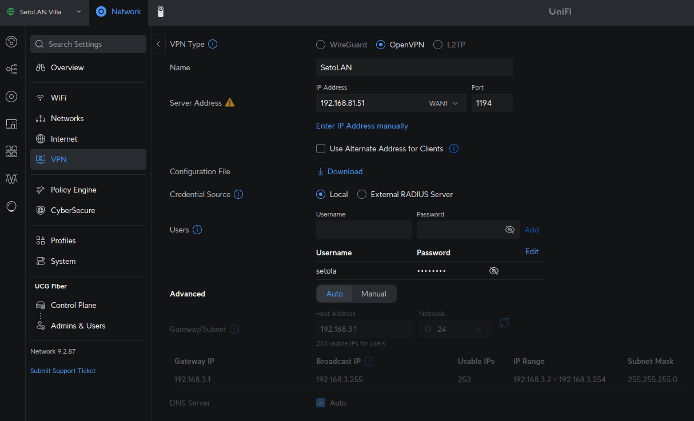

## Configure server

Go on UniFi panel and set a new server up following these menu entries

*Setting* > *VPN* > *VPN Server* > *Create New* > *OpenVPN*

## Export configuration

In the UniFi panel you can download a configuration file for your OpenVPN connection.


## Change crypto alghorithm

In oreder to make the exported .ovpn file on Ubuntu, you need to change the cipher algorithm from *AES-256-CBC* to *AES-256-GCM*

```bash
sed -i 's/cipher AES-256-CBC/cipher AES-256-GCM/' myvpn.opvn
```

## Remove default routers

If you want to access your remote network but use your local for regular internet access you need to remove routes pushed by vpn server, by adding these lines to *.ovpn* file.

```
route 192.168.82.0 255.255.255.0
route-metric 50
route-nopull
```

## Public IP

Be sure to use a reachable IP as your *remote*