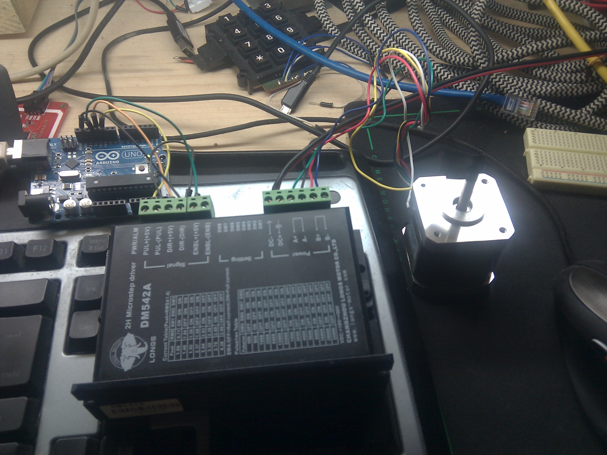
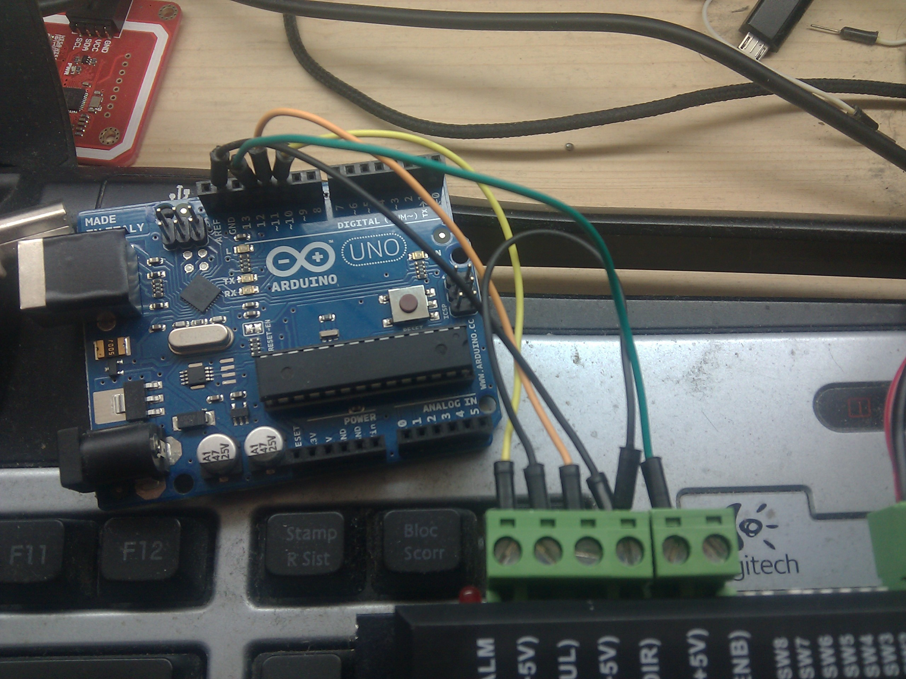

Some days ago I've purchased some **cheap but powerful stepper motors bundle** from china.
In the package there is also a nice pul\\dir driver, code-named **Long Motor DM542A**.
My original plan was to use an Arduino to make the motor spinning around. To test if everything it's working I've
connected one of these drivers to my Arduino UNO:

* PUL+ to pin 10
* PUL- to gnd
* DIR+ to pin 11
* DIR- to gnd
* ENBL+ to pin 12
* ENBL- to gnd





Then I wrote this simple sketch to make it spinning: 

```ino
int pulPin = 10;
int dirPin = 11;
int enblPin = 12;
int ledPin = 13;

int loops = 0;

void setup() {
  // put your setup code here, to run once:
  pinMode(pulPin, OUTPUT);
  pinMode(dirPin, OUTPUT);
  pinMode(enblPin, OUTPUT);
  pinMode(ledPin, OUTPUT);
  
  digitalWrite(pulPin, LOW);
  digitalWrite(ledPin, LOW);
  digitalWrite(enblPin, LOW);
  digitalWrite(dirPin, LOW);
  
  Serial.begin(9600);
  Serial.println("init");
  
  digitalWrite(enblPin, HIGH);
  delay(100);
  digitalWrite(enblPin, LOW);
}

void loop() {
  // put your main code here, to run repeatedly: 
  digitalWrite(pulPin, HIGH);
  digitalWrite(ledPin, HIGH);
  digitalWrite(pulPin, LOW);
  digitalWrite(ledPin, LOW);
  
  delay(1);
}
```

Yes it's barely a square wave generator :) Considerations:

* You will need a lot of pulses to see something moving, that's why I've set the loop interval to 1ms.
* It's nice to play with dip switches and see what happens if you set dip5-8 to off: the motor seems to be almost
  stationary
* Setting ENBL+ to 0v (logical 0, false) release the motor holding torque, this is really necessary in every project
  because of the heat produced when ENBL is set to logical 1.
* Setting ENBL+ to 0 cause the red error led on the DM542A to turn on. I don't think this is an error, but anyway it
  means that the motor is not holding it's place.

Now that I'm sure this motor is working properly I'll take the [grbl](https://github.com/grbl/grbl "grbl") firmware and
flash it into my UNO and do some basic movement testing while
my [Shapeoko 2](http://www.shapeoko.com/ "Shapeoko - Open source CNC Router\Miller") kit will be produced and shipped :)