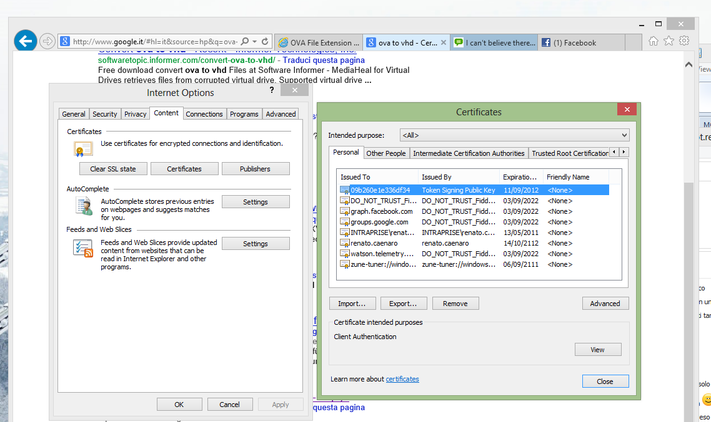

Today I reached the task to make the **PHPMyAdmin install secure** on one of my Ubuntu servers. The machine is
running **Ubuntu Server 12.10**, but you can follow this article also for Ubuntu 13.04 and newer. Since a web
multi-domain server is running on it, my idea is:

* Have only **one third level to reach PHPMyAdmin**: pma1.mydomain.ltd
* **Remove /phpmyadmin** from every domain.
* Additional security is provided by **http authentication**.

## Install phpmyadmin

As you may know install software in Ubuntu is pretty easy:

```bash
sudo apt-get install phpmyadmin
```

and the job is done. When (and if) you'll be prompted,
chose [Cookie Auth](http://wiki.phpmyadmin.net/pma/Auth_types#cookie "PHPMyAdmin Cookie Auth"): database username and
password will be prompted by the application and not stored in it.

## Configure Apache

Now we need to **make Apache aware of PHPMyAdmin** existence.

```bash
sudo nano /etc/apache2/sites-available/phpmyadmin.conf
```

and put this in it:

```apacheconf
# phpMyAdmin default Apache configuration

<VirtualHost *:80>

  ServerAdmin webmaster@mydomain.ltd
  ServerName pma1.mydomain.ltd
  DocumentRoot /usr/share/phpmyadmin

  <Directory /usr/share/phpmyadmin>
    Options FollowSymLinks
    DirectoryIndex index.php
    AuthType Basic
    AuthName "RESTRICTED ACCESS"
    AuthUserFile /srv/www/.htpasswd
    Require user myusername
    <IfModule mod_php5.c>
      AddType application/x-httpd-php .php
      php_flag magic_quotes_gpc Off
      php_flag track_vars On
      php_flag register_globals Off
      php_admin_flag allow_url_fopen Off
      php_value include_path .
      php_admin_value upload_tmp_dir /var/lib/phpmyadmin/tmp
      php_admin_value open_basedir /usr/share/phpmyadmin/:/etc/phpmyadmin/:/var/lib/phpmyadmin/
    </IfModule>
  </Directory>

  # Disallow web access to setup
  <Directory /usr/share/phpmyadmin/setup>
    Order Deny,Allow
    Deny from All
  </Directory>

  # Disallow web access to libraries
  <Directory /usr/share/phpmyadmin/libraries>
    Order Deny,Allow
    Deny from All
  </Directory>

</VirtualHost>
```

Let's create the directory /srv/www if we still don't have it

```bash
sudo mkdir /srv/www
```

Let's save user and password for the require account

```bash
sudo htpasswd -c /var/www/citexnetwork/.htpasswd myusername
```

I suggest to use a **random generated alphanumeric long password** and store it in your Lastpass account, if you
trust such project, or whatever keyring you're confident with. Add **PHPMyAdmin to the enabled sites** and **reload
Apache**

```bash
sudo a2ensite phpmyadmin
sudo service apache2 reload
```

## Test

1. Open chrome in a new incognito mode (another browser is OK too as far as you never open PHPMyAdmin with it to avoid
   caching issued) and visit pma1.mydomain.ltd is should ask you for user and pass for http auth, and then user and pass
   for the database.
2. If you visit pma1.mydomain.ltd/setup you should have a 403 Forbidden error.
3. The same if you visit pma1.mydomain.ltd/libraries .

## Other security improvements

### Don't use the root account to log in

Use username and password for the specific database instead. For example in a typical WordPress installation you can
find them in wp-config.php file. This will reduce the risk to make unwanted changes\\drops\\truncates\\updates on the
wrong db due to a low level of caffeine in your blood.

### Use SSL encription

If you have a 30$ to spend for a cheap certificate, spend them, otherwise (like I do) use auto-generated certificates.
To use a self signed certificate:

```bash
sudo a2enmod ssl
cd /tmp
sudo openssl req -new > new.cert.csr
sudo openssl rsa -in privkey.pem -out new.cert.key
sudo openssl x509 -in new.cert.csr -out new.cert.cert -req -signkey new.cert.key -days 1825
sudo cp new.cert.cert /etc/ssl/certs/server.crt
sudo cp new.cert.key /etc/ssl/private/server.key
```

and then tell apache to use https protocol and redirect from http to https.

```apacheconf
<VirtualHost *:80>

  SSLEngine on
  SSLOptions +StrictRequire
  SSLCertificateFile /etc/ssl/certs/server.crt
  SSLCertificateKeyFile /etc/ssl/private/server.key

  RewriteEngine On
  RewriteCond %{HTTPS} !=on
  RewriteRule ^/?(.*) https://%{SERVER_NAME}/$1 [R,L]

</VirtualHost>
```

To remove the boring Windows warning about certificate "untrustability", wich affects also chrome, look at this screen:


### Filter by IP

If you connect from a static ip (I do not), grant access only from that one by adding these lines to the above Apache
config file:

```apacheconf
<Directory /usr/share/phpmyadmin>

  Order allow,deny
  Allow from 192.168.1.0/24

</Directory>
```